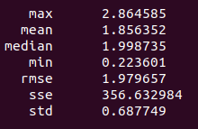

This project is based on eigen, ceres and sophus.

Red line --- Groudtruth pose of A.

Yellow line --- Pose with noise of A.

Purple line --- Pose after graph optimization of A.

Blue line --- Groudtruth pose of B.

Cyan line --- Pose with noise of B.

White line --- Pose after graph optimization of B.

You can run `scripts/trajectory_visualization.py` and `rviz` to visualize the poses.

## visualization results

    

## evo evaluation results

### pose with noise

- APE

  
     

  
     

- RPE

  
     

     

### pose after optimization

- APE

  
     

  
     

- RPE

  
     

  
     

